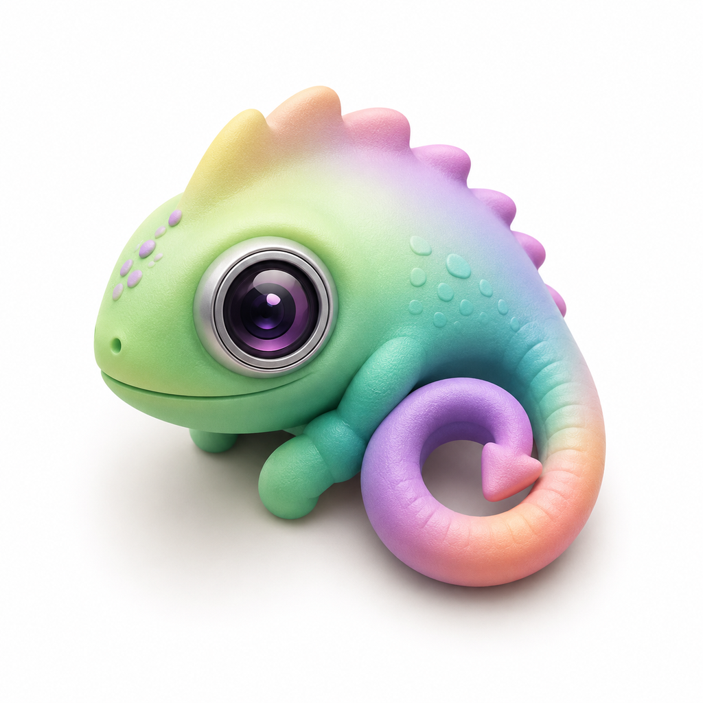

<p align="center">
  
</p>

# Chameo

Chameo is a macOS menu bar app for taking quick daily selfies and storing the photos in a dedicated Photos.app album. The name leans into the idea of seeing how your face, mood, style, and life change over time.

The app is intentionally small: click the camera icon in the menu bar, take a photo, preview it, then save it or retake it.

## Features

- Menu bar camera icon with a compact popover UI.
- Camera tab with mirrored live preview and optional face guide.
- Capture preview flow:
  - `Take Photo` captures into memory only.
  - `Save to Photos` writes the image to Photos.app.
  - `Retake` discards the in-memory preview without touching Photos.
  - Return performs the primary action; Escape retakes from preview.
- Optional automatic face alignment produces consistent square photos and falls back to the original when alignment is unavailable.
- Library tab with thumbnails grouped by local date.
- Library rows show local date/time and location name when available.
- Library shows rolling 30-day capture progress and missed dates; today remains pending until it is complete.
- Dedicated Photos.app album name configurable in Settings. If Photos already has an album with the same name, Chameo uses that album instead of creating another one. If the album is deleted externally, the next save recreates it.
- Optional location metadata on saved photos, off by default.
- Reminder scheduling with none, daily, and weekly repeat modes.
- Clicking a reminder notification opens the app directly to the Camera tab.
- Optional hourly follow-up reminders stop for the day after a selfie is saved.
- Permission-denied states include direct System Settings recovery actions.
- Library deletion removes the original photo from Photos.
- Optional launch-at-login support.
- Menu-bar-only app with no Dock icon.

## Quick Start

Requirements:

- macOS 14 or newer.
- Xcode command line tools or Xcode with SwiftPM support.

Build app bundle:

```bash
./script/build_app.sh
```

Build a release app bundle:

```bash
./script/build_app.sh --release
```

The script builds the SwiftPM executable, stages a local `.app` bundle in `dist/`, writes the required `Info.plist`, applies the development entitlements, ad-hoc signs the app, and prints the bundle path.

## Permissions

Chameo asks for permissions only when needed:

- Camera: required for live preview and capture.
- Photos: required to create/use the album, save photos, list library items, and delete photos from Photos.
- Location: optional, only when `Save photo location` is enabled.
- Notifications: requested when reminder settings are scheduled.

Library deletion removes the original photo from Photos. Photos may move deleted items to Recently Deleted according to the system Photos behavior.

## Documentation

- [Architecture](docs/architecture.md)
- [Development](docs/development.md)
- [Permissions & Privacy](docs/permissions.md)
- [Roadmap](docs/roadmap.md)
