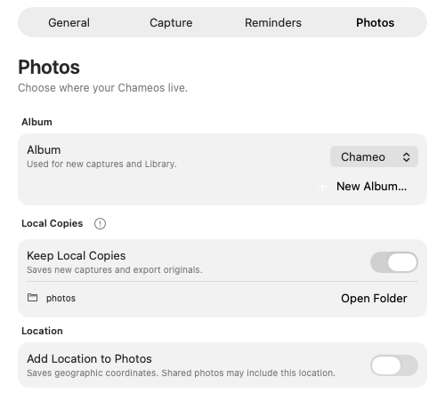
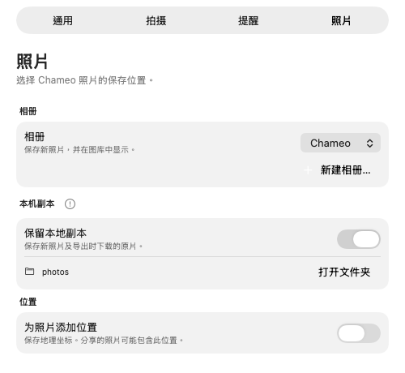
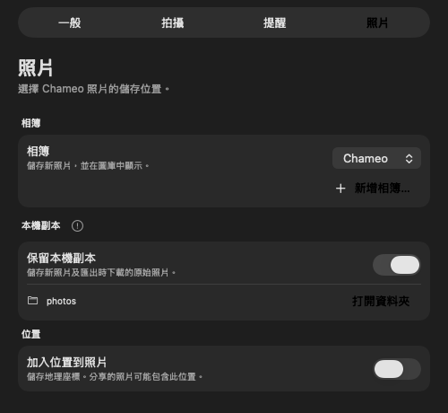

# Review fixes — October 4, 2026

Implemented the eleven findings from the [whole-repository audit](../full-review-2026-10-03/review.md) on `feat/review-fixes`. The original audit describes commit `1352ff1b033a01487a3a19761967904778bafa5a`; its source line citations and screenshots are historical evidence.

| Finding | Implementation | Regression evidence |
| --- | --- | --- |
| 1. Reminder refresh race | Settings reconciliation, preference commit, and legacy migration share the operation queue. Refresh reads preferences after joining it. | Enable/change versus gated authorization and refresh; disable, denied authorization, and migration-versus-save cases; planning reads current time after authorization. |
| 2. Lost photo draft | AppState owns CaptureReviewStore; both main hosts observe it. Draft preparation/save continue across navigation. Retake discards; failed save retains the draft. Only the visible main host posts accessibility announcements. A save refresh cannot replace a newer selected album. | Navigation during preparation, duplicate capture/save, failed retry, explicit discard, and reopening with a draft. |
| 3. Location consent | All three permission localizations, fallback strings, settings hint, README, and privacy document disclose geographic coordinates and sharing implications. | Localization suite, all-language layout fixtures, and native English Photos Settings/accessibility tree. |
| 4. Repeated calendar work | LibraryStore caches capture-day index and sorted per-day assets per asset/calendar snapshot. | Cache reuse, reload/deletion invalidation, time-zone change, DST, availability and status semantics; optimized source-model benchmark. |
| 5. Album reentrancy | In-flight album creation is coalesced per normalized name. Different names can proceed independently; failure permits retry. | Concurrent same-name requests share an object and one creation; other-name and failure/retry cases. |
| 6. Thumbnail cancellation | A locked continuation/request-ID owner forwards task cancellation to PhotoKit, ignores degraded results, and handles terminal errors once. | Cancellation before continuation/ID, late and duplicate callbacks, and completion followed by cancellation. |
| 7. Release recovery | Existing release assets are downloaded and validated against tag metadata/build identity. Appcast generation reuses their bytes; mutation is rejected. Publication is skipped for that existing release. | API failure/missing-tag distinction, complete metadata, size/digest, ZIP identity/path checks, and real ZIP/DMG/notes byte preservation through two packaging runs. |
| 8. Feed concurrency | Release and Repair use the same workflow-wide lock. A deployment-only retry rejects changed public feed revisions; post-deployment checks compare the exact expected digest. | Feed revision fixtures cover new, idempotent, stale and missing-output cases; YAML syntax parsed. |
| 9. Entitlement validation | Signed feature grants must be Boolean true; Sparkle names must match the release bundle. | False, missing, malformed and wrong-name fixtures; actual signed release bundle validation. |
| 10. Login approval | Pending approval counts as registered. Disable unregisters it; General keeps approval guidance and an Open Login Items action. | Policy cases for all four SMAppService statuses. |
| 11. Documentation | Corrected notification/export, Pictures-folder, distribution and album contracts. Repaired retained image links and marked missing temporary captures as archived. | Current contract reviewed against source; retained review image links checked. |

## Validation

- Full Swift suite: **236 tests, one optional layout-export skip, zero failures**. The skipped renderer was also run separately and passed.
- Complete Swift concurrency checking: passed.
- Python release validation: **11 tests, zero failures**, plus stable/prerelease signed-feed and release-tooling fixtures.
- Ad-hoc release bundle: built and passed deep signature, architecture, metadata, resource and effective entitlement checks.
- Isolated test app: built, signed and launched successfully. Camera/Photos onboarding showed existing grants. Native Photos Settings displayed the new hint without clipping and exposed it on the location switch. The app reported no available camera.
- Modern native layout fixtures: **171 images** across three languages and four appearances; renderer passed. Selected updated Photos settings layouts are retained below. Cached native controls are not compositor evidence for contrast.
- Recovery packaging: real temporary signed app/ZIP/DMG/notes exercised fresh generation and recovery. All three asset hashes remained unchanged. A public RFC 8032 test key and a matching fixture app public key were used; no production signing key or published release was changed. The fixture and output are retained in [packaging-recovery.py](packaging-recovery.py) and [packaging-recovery.log](packaging-recovery.log).

The optimized current-source day-index benchmark measured approximately **0.10 ms for 42 lookups** at 10,000 captures, with **12.3 ms one-time construction**. The original audit measured 406.6 ms for its repeated full-history path. These are model timings, not measured SwiftUI frame times; grouping/sorting assets and PhotoKit fetches are excluded. See [benchmark source](calendar-benchmark.swift) and [output](calendar-benchmark.txt).

Physical capture, Photos save/delete/iCloud transfer, actual login-item approval, VoiceOver, and a deployed GitHub release recovery remain manual integration checks. They were not performed here. The release build retains the existing Core Location geocoder deprecation warnings. Version 0.5.6 is unchanged; these are local implementation changes, not a published release.

Validation logs: [Swift tests](tests.log), [concurrency](concurrency.log),
[release tooling](release-tooling.log), [bundle build](release-bundle.log),
[bundle validation](bundle-validation.log), [test-app launch](test-app-launch.log),
and [layout previews](layout-previews.log).

## Updated layout evidence

